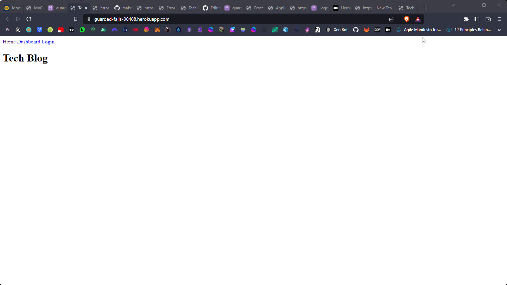

# MVC-techBlog

## Description
        
This application was intented to be a Blog site, where users could make and interact with blog posts.

 

## Table of Contents
- [Installation](#installation-installation)
- [Usage](#usage-usage)
- [License](#license-license)
- [Contributing](#contributing-contributing)
- [Tests](#tests-tests)
- [Questions](#questions-questions)
        
## Installation {#installation}
        
Visit Url

## Usage {#usage}
        
Once you visited url you can see main view, if you click on home, you are redirect to homepage url, when you click dashboard the application can't find dashboard.handlebars view.
        
## License {#license}
        
None
        
## Contributing {#contributing}
        
No guidelines
        
## Tests {#tests}
        
Can test application by clicking the navigation bar links, and you can visit the currently defined "/" "/homepage" "/login" "/dashboard" urls.
        
## Questions {#questions}
If you have any questions, please feel free to contact me at alex.horning.54@gmail.com 
or check out my GitHub profile at [Makeitouthill](https://github.com/Makeitouthill).
